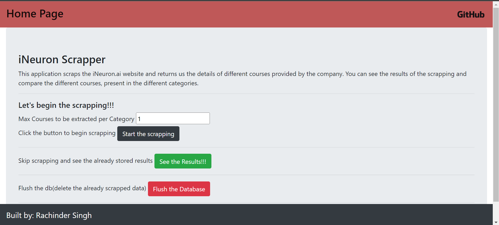

# iNeuron Data Scrapper

This project aims to scrap data from iNeuron.ai webiste.
Data is extracted and split in different categories.

# Project Navigation

1) database: Directory containing the sqlite database

2) driver: Directory containing the chrome webdriver

3) logger: Package implementing the logging class

4) pickle_dump: Directory containing the pickle_dump. This 
is used to stored the categories list. This helps in implementing
the results without scrapping function view.

5) scrapping: Package implementing the class for scrapping

6) sqlite: Package implementing the class for implementing sqlite functions.

7) app.py: Main script.

8) static: Directory containing the static files.

9) templates: Directory containing the templates.

# Screenshots

#### Main page of application

Different buttons:

Start the scrapping: Scrapes the data 

See the results: Without scrapping, display the results.

Flush the Database: Deletes the already scrapped data.

